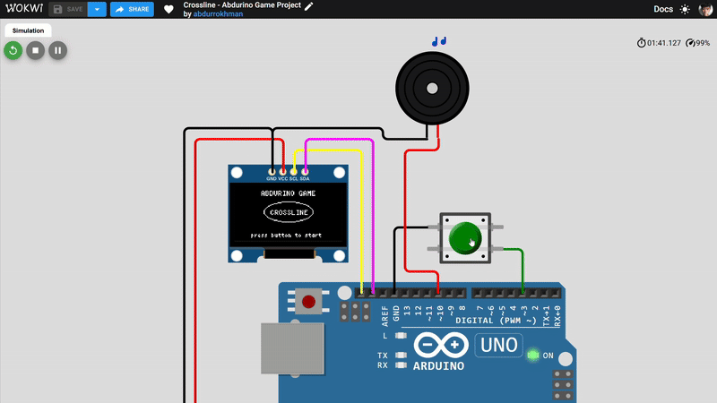

# 🎮 Crossline

Crossline adalah game sederhana berbasis **Arduino** dengan layar **OLED SSD1306 (128x64)**. Pemain harus bertahan hidup dengan menghindari mobil dan motor yang melintas di jalan sambil berdiri di tengah jalur.

👉 **Coba langsung di Wokwi:** [Crossline (Simulator)](https://wokwi.com/projects/437963087229784065)

---

## 🚀 Fitur

* Grafik monokrom berbasis bitmap dengan **U8g2lib**.
* Mekanik **lompat untuk menghindari rintangan**.
* Awan dan elemen latar untuk mempercantik visual.
* Efek suara **buzzer** untuk aksi lompat dan game over.
* Desain ringan dan bisa dijalankan di board **Arduino Uno/Nano**.

---

## 🛠️ Hardware yang Dibutuhkan

1. **Arduino Uno/Nano** (atau board lain yang kompatibel)
2. **OLED SSD1306 128x64 I2C**
3. **Push Button** untuk kontrol lompat
4. **Buzzer** untuk efek suara
5. Breadboard & jumper wire

---

## 🔌 Skema Pin

| Komponen   | Pin Arduino        |
| ---------- | ------------------ |
| Button     | D3 (INPUT\_PULLUP) |
| Buzzer     | D10                |
| OLED (SCL) | A5 (SCL)           |
| OLED (SDA) | A4 (SDA)           |

> Gunakan **I2C** default (SDA/A4, SCL/A5) untuk Arduino Uno.

---

## 📦 Instalasi Library

Pastikan library berikut sudah terpasang di Arduino IDE:

* [U8g2lib](https://github.com/olikraus/u8g2)
* Library `Wire` (bawaan Arduino IDE)

---

## ▶️ Cara Main

1. Upload sketch **Crossline.ino** ke Arduino.
2. Tekan tombol untuk memulai game.
3. Tekan tombol lagi untuk **melompat** saat bermain.
4. Hindari semua kendaraan yang lewat, kalau tertabrak → **Game Over**.

👉 Bisa dicoba tanpa Arduino di [Wokwi Simulator](https://wokwi.com/projects/437963087229784065)

---

## 📜 Struktur Game

* **gameStart** → Tampilan menu
* **gamePlaying** → Pemain bisa lompat dan skor berjalan
* **gameEnd** → Tampilan Game Over + bisa restart

---

## 🎨 Aset Bitmap

Semua gambar player, mobil, motor, dan awan ada di file **assets.h**.
Format: `panel.drawXBM(x, y, width, height, image_bits);`

---

## 📷 Preview

---

## ✨ Kontributor

Dibuat oleh **Abdurrokhman**.
Ide & nama game: **Crossline** (karena pemain berdiri dan bertahan di tengah jalan).
